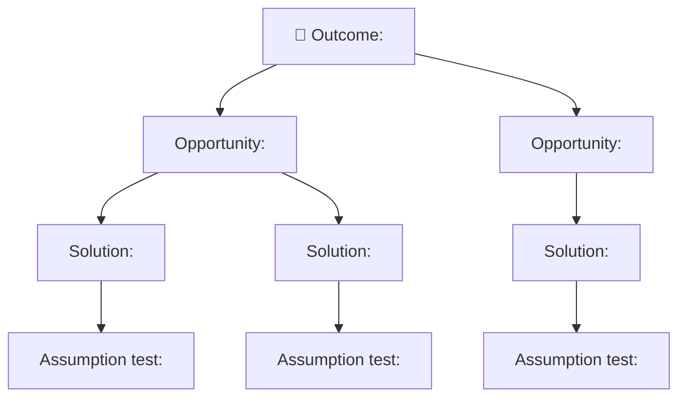

# Opportunity–Solution Tree — <Idea Title>

<!--
Teresa Torres's opportunity-solution-tree, rendered as Mermaid (GitHub renders it
natively — no whiteboard tool needed). Structure: one desired OUTCOME → the
OPPORTUNITY space (customer needs/pains) → the SOLUTION space → ASSUMPTION tests.
A living document — revisit as you learn. Owner: Mary (Analyst).
-->

- **Slug:** `<slug>`
- **Last updated:** <YYYY-MM-DD>

## Notes
- **Outcome** is a metric, not a feature. Everything below serves it.
- Prefer breadth in the opportunity space before committing to a solution.
- Each solution should bottom out in the *cheapest* test that could invalidate it.
