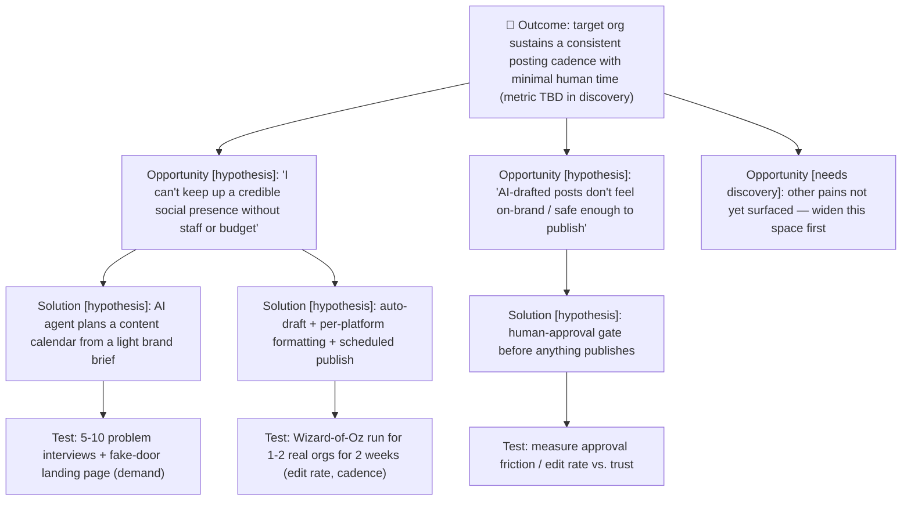

# Opportunity–Solution Tree — ContentTwin

<!--
Teresa Torres's opportunity-solution-tree, rendered as Mermaid (GitHub renders it
natively — no whiteboard tool needed). Structure: one desired OUTCOME → the
OPPORTUNITY space (customer needs/pains) → the SOLUTION space → ASSUMPTION tests.
A living document — revisit as you learn. Owner: Mary (Analyst).
-->

- **Slug:** `content-twin`
- **Last updated:** 2026-07-12

> **TODO — needs discovery.** This tree is scaffolded from the concept (the repo's
> one-line description) only. Every node below the outcome is a **hypothesis**, not a
> validated opportunity or solution. The opportunity space has not been widened with
> real user research — do that before committing to any solution branch. Solutions
> shown are candidates to test, not decisions.

## Notes

- **Outcome** is a metric, not a feature — the exact metric (e.g. % of weeks hitting planned volume under X minutes of human time) is **unset; define it in discovery.**
- **Prefer breadth in the opportunity space before committing to a solution** — currently only two opportunities are hypothesized from a one-line concept; `OPP3` is a placeholder to force widening with real research.
- Each solution should bottom out in the *cheapest* test that could invalidate it (see `brief.md` §6 for the assumption/test table these map to).
